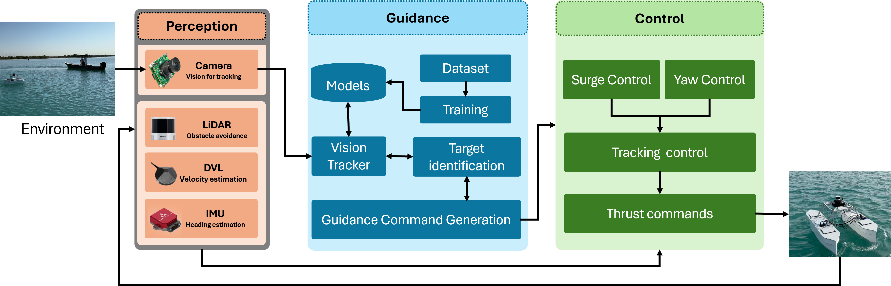
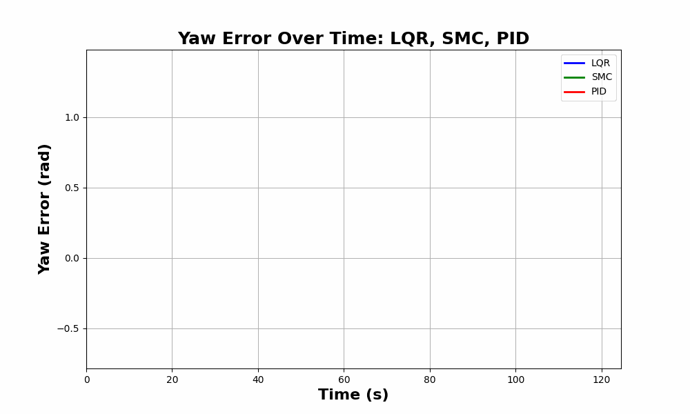

  
  
  {% include button.html text="FAQs" icon="twitter" link="https://twitter.com/intent/tweet/?url=https://alembic.darn.es&text=Alembic%20-%20A%20Jekyll%20boilerplate%20theme&via=DavidDarnes" color="#0d94e7" %}

## Overview

    Vision-based target detection and tracking are crucial for Unmanned Surface Vehicles (USVs) to perform tasks such as inspection, monitoring, and surveillance. However, real-time tracking in complex maritime environments is challenging due to factors such as dynamic camera movement and changing sea conditions. Traditional object detection methods combined with filtering techniques are commonly used for tracking, but they often lack robustness, particularly in the face of camera motion and missed detections. Although advanced tracking methods have been proposed recently, their application in real-time maritime scenarios remains limited. To address this gap, this study proposes a vision-guided object tracking framework for USVs, integrating state-of-the-art tracking algorithms with low-level control systems to enable precise tracking in dynamic maritime environments. We benchmarked the performance of five distinct trackers, developed using advanced deep learning techniques such as Convolutional Neural Networks (CNNs) and Transformers, by evaluating them on both simulated and real-world maritime datasets. In addition, we evaluated the robustness of various control algorithms in conjunction with these tracking systems. The proposed framework was validated through simulations and real-world sea trials, demonstrating its effectiveness in handling dynamic maritime conditions.

## Tracking results 

<video controls="" width="800" height="500" muted="" loop="" autoplay="">
<source src="https://github.com/Muhayyuddin/tracking/raw/main/video/tracking.mp4" type="video/mp4">
</video>

<video controls="" width="800" height="500" muted="" loop="" autoplay="">
<source src="https://github.com/Muhayyuddin/tracking/raw/refs/heads/main/video/trackers.mp4" type="video/mp4">
</video>

-Add some videos and gif of tracking
-add some plots of controller
## Tracking Framework

  

Add the image of the tracking framework with a short description.

## Controllers 

  

## FAQs
-Q1- Why we choose these trackers 
-Q2- Why we choose these particular COntrollers 
-Q3- What is the benefit of this research work

